# Star Tracker Report

**2026-08-12** | Total: **8062 stars** | Change: **+13**

> Compared to snapshot from 2026-08-11

## 📈 Star Trend

### By Repository

Individual Repository Charts

#### igareck/vpn-configs-for-russia

## Repositories

| Repositories | Stars | Change | Trend |
|:-----------|------:|-------:|:-----:|
| [igareck/vpn-configs-for-russia](https://github.com/igareck/vpn-configs-for-russia) | 8062 | +13 | ⬆️ |

## Summary

- **Stars gained:** 13
- **Stars lost:** 0
- **Net change:** +13

## 🔮 Growth Forecast

**Aggregate Forecast**

| Method | Week 1 | Week 2 | Week 3 | Week 4 |
|:---|---:|---:|---:|---:|
| Linear Regression | 8308 | 8553 | 8799 | 9044 |
| Weighted Moving Average | 8306 | 8550 | 8794 | 9039 |

### By Repository

igareck/vpn-configs-for-russia

**igareck/vpn-configs-for-russia**

| Method | Week 1 | Week 2 | Week 3 | Week 4 |
|:---|---:|---:|---:|---:|
| Linear Regression | 8308 | 8553 | 8799 | 9044 |
| Weighted Moving Average | 8306 | 8550 | 8794 | 9039 |

---
*Generated by [GitHub Star Tracker](https://github.com/fbuireu/github-star-tracker) on 2026-08-12T02:48:08.091Z*

*Made with 🤘 by [Ferran Buireu](https://github.com/fbuireu)*

