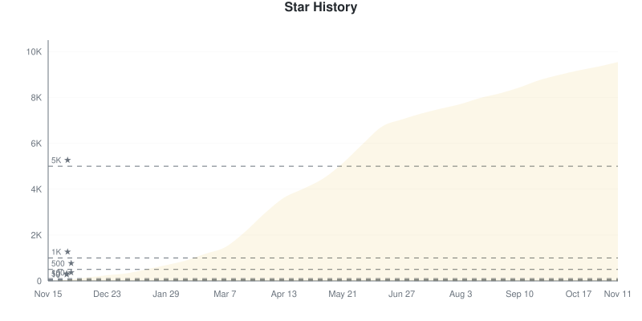
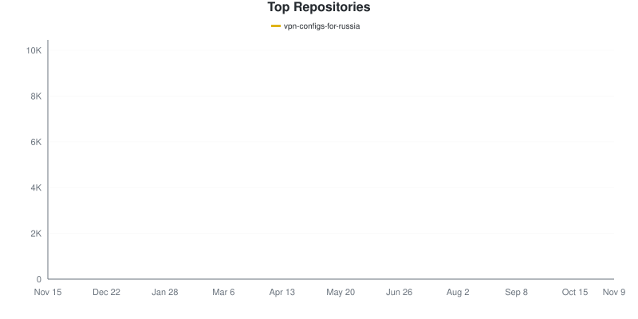
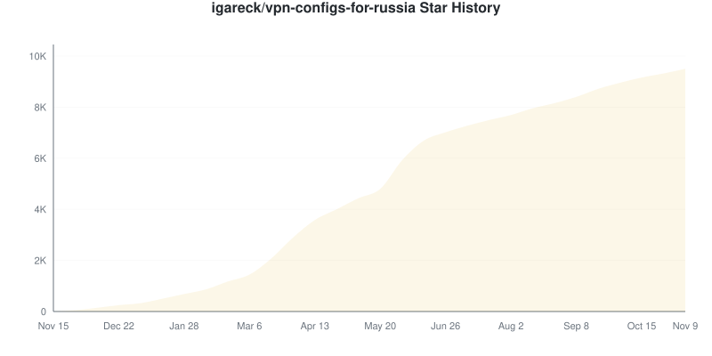
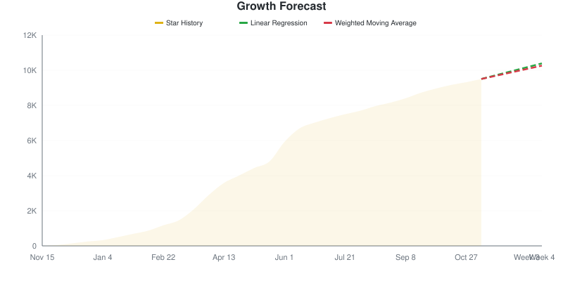

# Star Tracker Report

**2026-11-01** | Total: **9399 stars** | Change: **+12**

> Compared to snapshot from 2026-10-31

## 📈 Star Trend

### By Repository

Individual Repository Charts

#### igareck/vpn-configs-for-russia

## Repositories

| Repositories | Stars | Change | Trend |
|:-----------|------:|-------:|:-----:|
| [igareck/vpn-configs-for-russia](https://github.com/igareck/vpn-configs-for-russia) | 9399 | +12 | ⬆️ |

## Summary

- **Stars gained:** 12
- **Stars lost:** 0
- **Net change:** +12

## 🔮 Growth Forecast

**Aggregate Forecast**

| Method | Week 1 | Week 2 | Week 3 | Week 4 |
|:---|---:|---:|---:|---:|
| Linear Regression | 9623 | 9847 | 10071 | 10295 |
| Weighted Moving Average | 9593 | 9786 | 9980 | 10174 |

### By Repository

igareck/vpn-configs-for-russia

**igareck/vpn-configs-for-russia**

| Method | Week 1 | Week 2 | Week 3 | Week 4 |
|:---|---:|---:|---:|---:|
| Linear Regression | 9623 | 9847 | 10071 | 10295 |
| Weighted Moving Average | 9593 | 9786 | 9980 | 10174 |

---
*Generated by [GitHub Star Tracker](https://github.com/fbuireu/github-star-tracker) on 2026-11-01T06:17:21.180Z*

*Made with 🤘 by [Ferran Buireu](https://github.com/fbuireu)*

