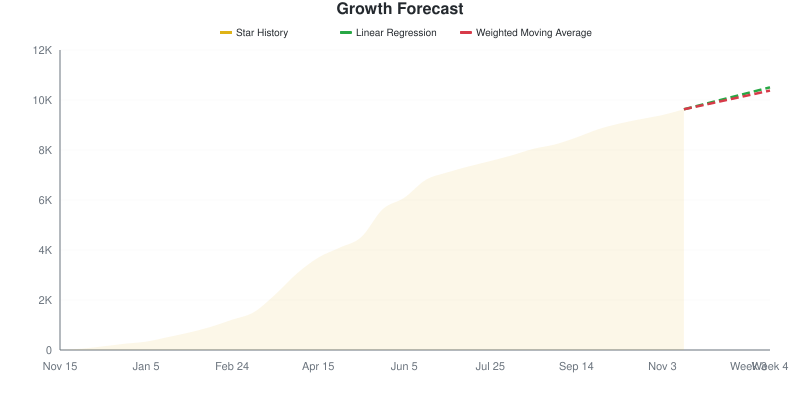

# Star Tracker Report

**2026-11-23** | Total: **9776 stars** | Change: **+25**

> Compared to snapshot from 2026-11-22

## 📈 Star Trend

### By Repository

Individual Repository Charts

#### igareck/vpn-configs-for-russia

## Repositories

| Repositories | Stars | Change | Trend |
|:-----------|------:|-------:|:-----:|
| [igareck/vpn-configs-for-russia](https://github.com/igareck/vpn-configs-for-russia) | 9776 | +25 | ⬆️ |

## Summary

- **Stars gained:** 25
- **Stars lost:** 0
- **Net change:** +25

## 🔮 Growth Forecast

**Aggregate Forecast**

| Method | Week 1 | Week 2 | Week 3 | Week 4 |
|:---|---:|---:|---:|---:|
| Linear Regression | 9993 | 10211 | 10428 | 10645 |
| Weighted Moving Average | 9962 | 10148 | 10334 | 10519 |

### By Repository

igareck/vpn-configs-for-russia

**igareck/vpn-configs-for-russia**

| Method | Week 1 | Week 2 | Week 3 | Week 4 |
|:---|---:|---:|---:|---:|
| Linear Regression | 9993 | 10211 | 10428 | 10645 |
| Weighted Moving Average | 9962 | 10148 | 10334 | 10519 |

---
*Generated by [GitHub Star Tracker](https://github.com/fbuireu/github-star-tracker) on 2026-11-23T07:49:45.879Z*

*Made with 🤘 by [Ferran Buireu](https://github.com/fbuireu)*

